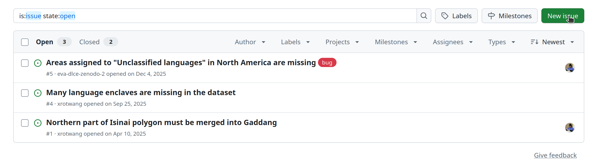
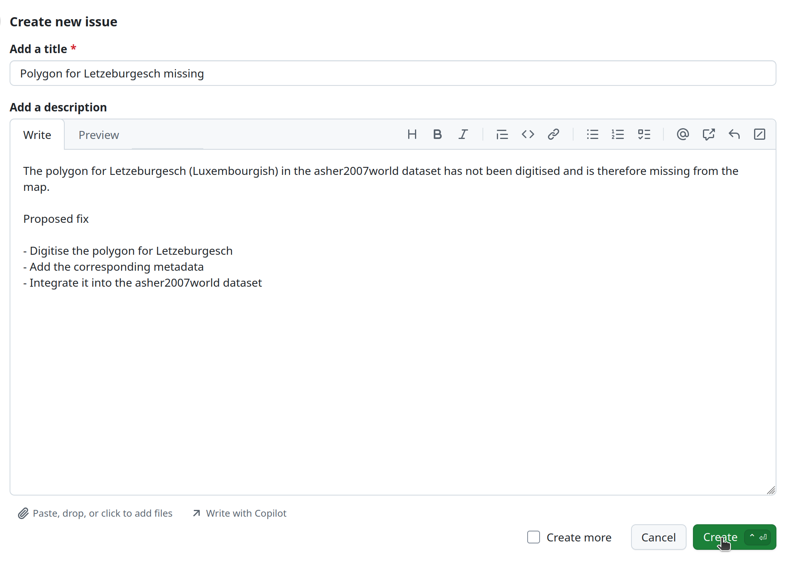
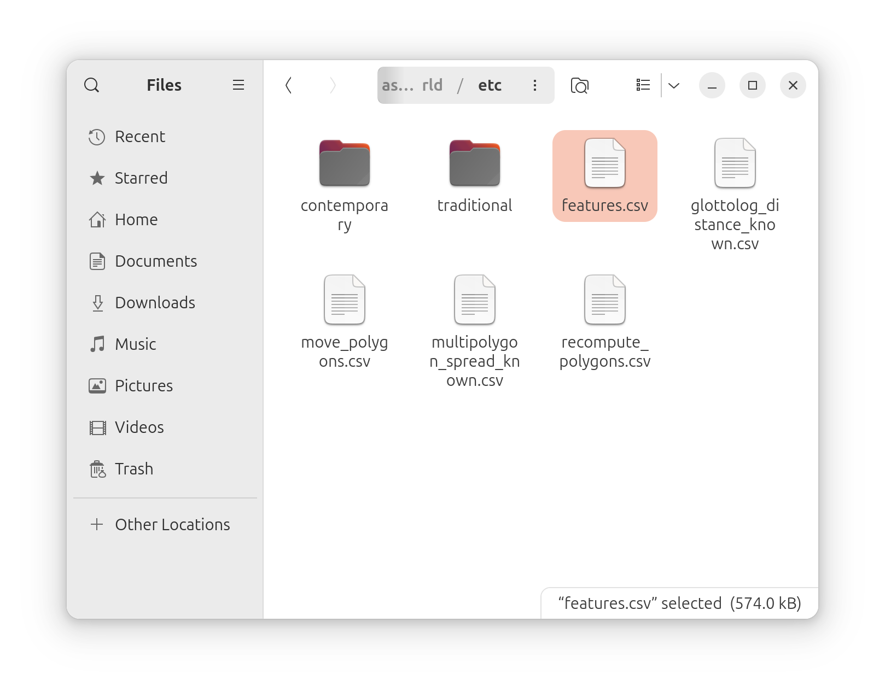
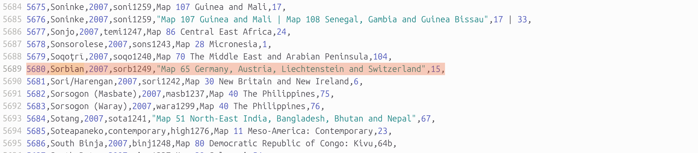
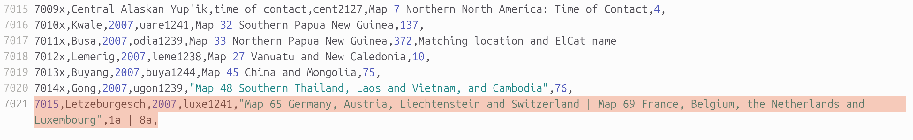
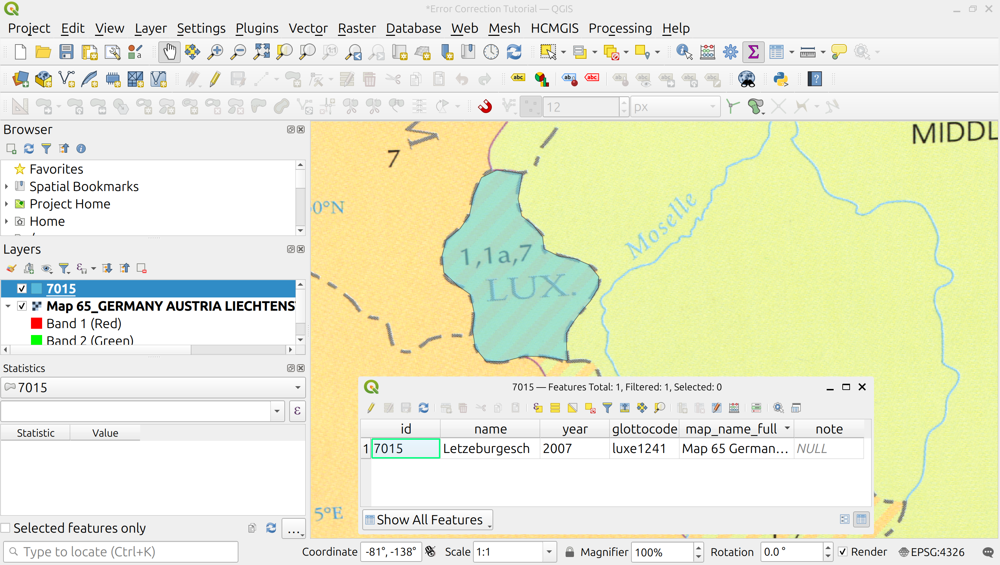
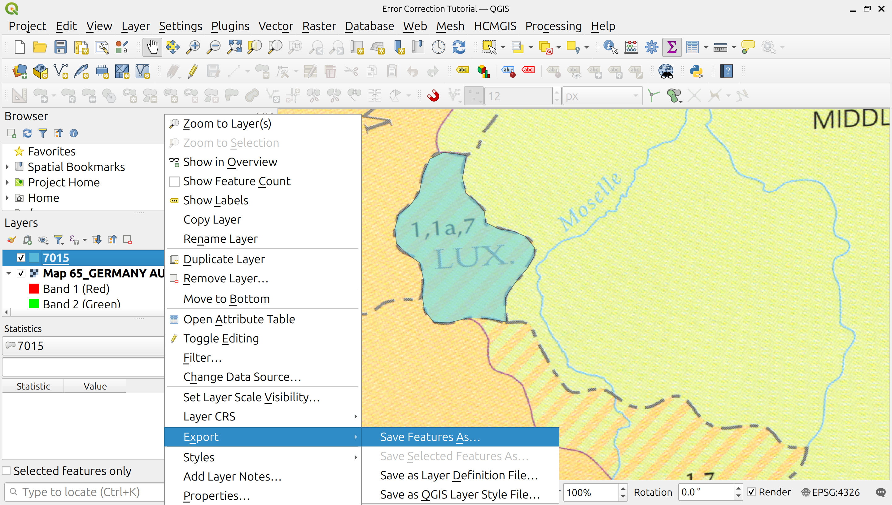
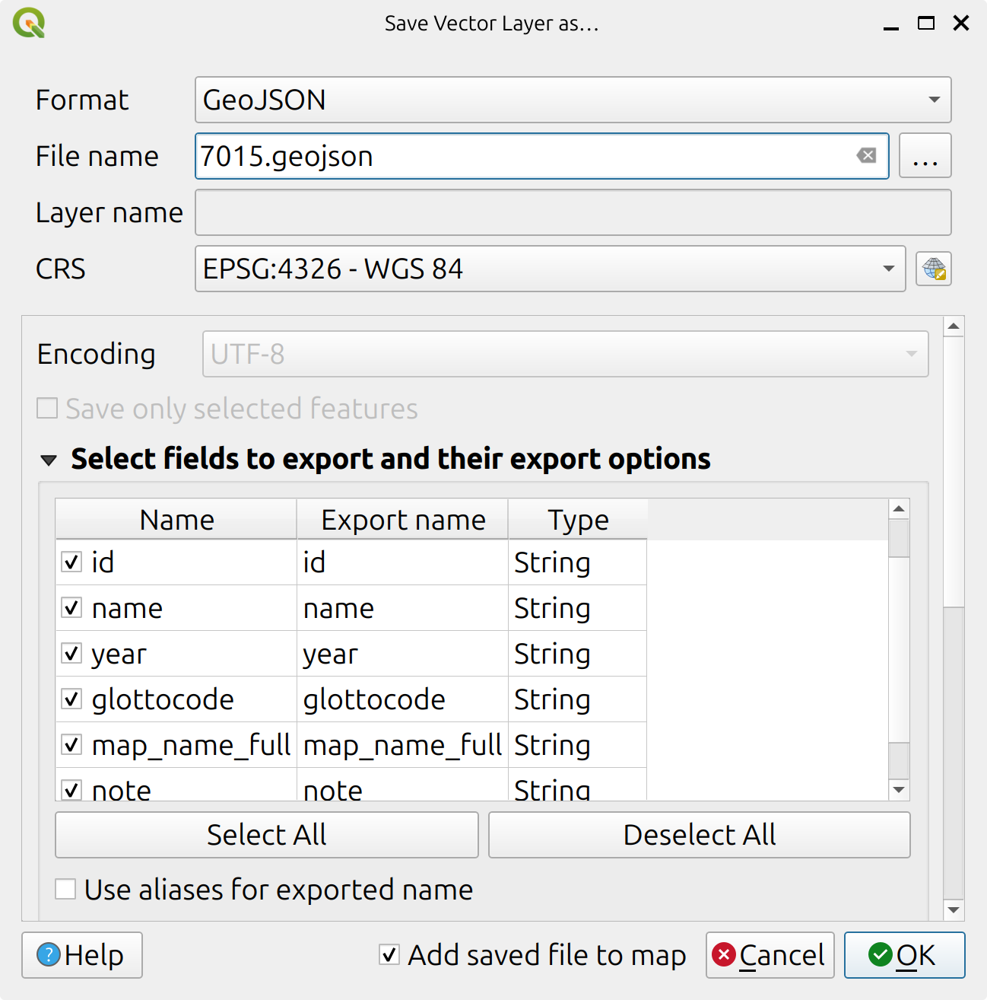
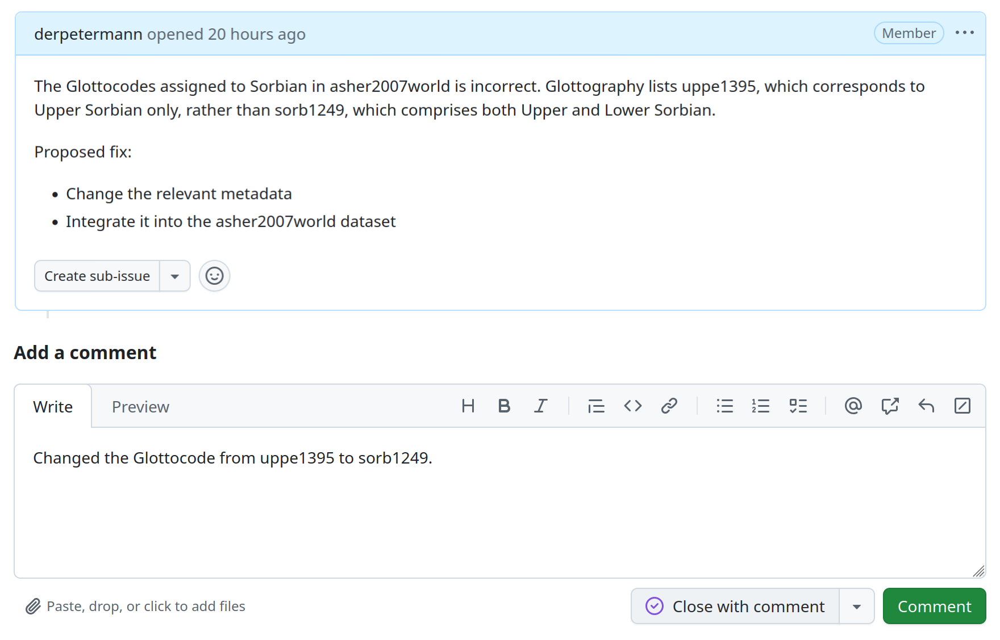

# Error correction

In a project with the scope of Glottography, errors are inevitable. To handle such issues systematically, Glottography follows a structured error correction workflow. Broadly, errors fall into two main categories:

- **Geometric errors**, such as missing, misplaced, or incorrect geometries.
- **Attribute errors**, where the geometry is correct but the associated metadata or attribute information is wrong or incomplete.

This tutorial walks you through the error-correction workflow used to identify and correct both types of errors in a transparent and reproducible manner.

We illustrate the workflow using two real examples that were identified during the revision of the Glottography data:

1. In *asher2007world*, the polygon for Luxembourgish (or *Letzeburgesch*, as referred to in the source) was not digitised and is therefore missing.
2. The Glottocode assigned to Sorbian in *asher2007world* is incorrect. The dataset lists **uppe1395**, which corresponds to Upper Sorbian only, rather than **sorb1249**, which comprises both Upper and Lower Sorbian.

To correct these issues, we followed a workflow consisting of four steps:

- [Raise an issue](#raising-an-issue) on GitHub.
- [Modify the attribute data](#modifying-the-attribute-data), the [geometry](#modifying-the-geometry), or both, depending on the issue.
- [Re-run the data curation script](#re-running-data-curation) to incorporate all changes  when generating the CLDF datasest.
- [Resolve the isusse](#resolving-the-issue).

---

### Raising an issue

When you encounter an error in a map or dataset, the first step is to report it on GitHub. This ensures that the issue is documented, discussed transparently, and tracked until resolution. 
In the *asher2007world* repository, navigate to the **Issues** page and click **New issue** in the upper-right corner.

<figure>
  
  <figcaption><em>Opening a new issue on GitHub.</em></figcaption>
</figure>

&nbsp;

In the issue form that appears, describe the problem clearly and, if possible, propose a fix. Once you are done, click **Create** to open the issue. Optionally, you can assign the issue to a specific contributor or add labels to indicate its type or priority.

In the example below, we raise an issue informing the team that the polygon for Letzeburgesch is missing and suggest that it be digitised and added to the dataset.

<figure>
  
  <figcaption><em>Raising the issue that the Letzeburgesch polygon is missing.</em></figcaption>
</figure>

&nbsp;

You would raise a similar issue to report the misassigned Glottocode for Sorbian. In many cases, the Glottography team will take over from this point. If you have write access to the repository yourself, you can proceed with the correction steps described in the following sections.
For that we first need to create a local clone of the repository. For more information see [GitHub's offical article on cloning a repository] (https://docs.github.com/en/repositories/creating-and-managing-repositories/cloning-a-repository). 

## Modifying the attribute data

To correct the erroneous Glottocode for Sorbian, we open the `features.csv` file. This file stores the attribute information for all polygons in the dataset’s `dataset.geojson` file.

Glottography maintains `features.csv` specifically to make updates straightforward. Instead of modifying attribute data directly in a GIS or editing the `dataset.geojson` file by hand, all attribute updates are performed in a plain text file without geometry. This approach reduces complexity, minimises the risk of accidental geometry changes, and allows edits to be made easily using any text editor. For more information on data curation practices in Glottography, see the tutorial on [Data Curation](../curation/index.md).

Here, we open the `features.csv` file located in the `etc` folder of a local clone of the repository using a simple text editor. Note that it would also be possible to edit the file directly on GitHub using the editing tool. 

<figure>
  
  <figcaption><em>The features.csv file in the etc folder of a Glottography repository.</em></figcaption>
</figure>

&nbsp;

Each row in `features.csv` corresponds to a single polygon in the dataset, while each column represents an attribute associated with that polygon. Locate the row corresponding to Sorbian and update the value in the `glottocode` column from **uppe1395** to **sorb1249**. Take care to preserve the overall structure of the file and avoid modifying any other fields unintentionally. 

<figure>
  
  <figcaption><em>Changing the Glottocode of an entry in the features.csv file.</em></figcaption>
</figure>

&nbsp;

Once the change is saved, the corrected Glottocode will be picked up automatically when the dataset is rebuilt in the subsequent steps of the workflow, with the `id` (e.g. 5680) linking the attribute information to the polygon in in `dataset.geojson`. 

Similarly, before adding the missing polygon for Letzeburgesch, we first add its metadata to the `features.csv` file. Since no polygon for Letzeburgesch currently exists in `dataset.geojson`, this requires creating a new entry in `features.csv`. In this case, the `id` must be new and unique, as it will correspond to the polygon ID that we add in the next step. The new entry includes the language name, a year, the Glottocode, the map name(s), and optional legend number(s).  For more information on attribute in Glottography, see the tutorial on [Attributes and metadata](../metadata/index.md).

For Letzeburgesch, we add the following row to `features.csv`:

<figure>
  
  <figcaption><em>Adding an entry to the features.csv file.</em></figcaption>
</figure>

&nbsp;

### Modifying the geometry 

We add the polygon geometry for Letzeburgesch in QGIS, following the steps outlined in the [Digitising tutorial](../digitising/index.md).  

<figure>
  
  <figcaption><em>The digitised polygon for Letzeburgesch and its attribute table.</em></figcaption>
</figure>

While digitising, we record the **`id`** of the polygon (`7015`) as attribute information, which links the polygon to its corresponding data in `features.csv`. In the figure above, the attribute table also shows additional fields such as `name` and `year`. These extra fields are not strictly necessary, as they will be automatically populated from `features.csv` when building the dataset. However, including them makes the polygon easier to identify and more human-readable during editing.  

Instead of exporting the polygon as a GeoPackage, as in the Digitising tutorial, we save it directly as **GeoJSON**, using the polygon `id` as the filename. This ensures that the replacement polygon can be automatically recognised by the error-correction workflow in Glottography. To do this right-click the layer > **Export** >  **Save Features As…**. 

<figure>
  
  <figcaption><em>Exporting the added polygon.</em></figcaption>
</figure>

&nbsp;

In the dialog that opens, set the **Format** to **GeoJSON**. Use the polygon `id` as the **Filename** and save the file to the **etc** folder in the repository.

<figure>
  
  <figcaption><em>The form for exporting the polygon as GeoJSON.</em></figcaption>
</figure>

&nbsp;

After saving, the **etc** folder should now contain an additional GeoJSON file named **`7015.geojson`**.

<figure>
  
  <figcaption><em>The 7015.geojson file in the etc folder.</em></figcaption>
</figure>

&nbsp;

To modify the geometry of an existing polygon, load it in QGIS, change its shape, and then export the updated polygon as GeoJSON, just as when adding a new polygon.

### Re-running data curation

Once we have updated the attribute information and added the geometry, we can rerun the data curation script (see the [Data Curation tutorial](../curation/index#running-the-data-curation-script)). This script uses the updated information in `features.csv` to generate the CLDF datasets: `features.geojson`, `languages.geojson`, and `families.geojson`.  The script also applies any polygons in the `etc` folder to replace or update the polygons in `dataset.geojson`. This approach preserves both new and existing polygons, allowing us to revert changes if necessary and providing a clear record of what was modified.  

In our case, there is no existing polygon with `id` 7015 in `dataset.geojson`, so no replacement occurs. Instead, the new polygon from `7015.geojson` in `etc` is simply added. Its metadata is automatically copied from the entry with `id` 7015 in `features.csv`.  

We can then verify that all changes have been applied downstream and that the updated metadata and geometries are present in the derived CLDF datasets, where applicable.

### Resolving the issue

After confirming the changes, we can push them to GitHub. For guidance, see GitHub's article on [managing files](https://docs.github.com/en/repositories/working-with-files/managing-files).  

Finally, add a comment on the issue and select **Close with comment** to mark it as resolved.

<figure>
  
  <figcaption><em>Closing the issue on GitHub.</em></figcaption>
</figure>

&nbsp;
