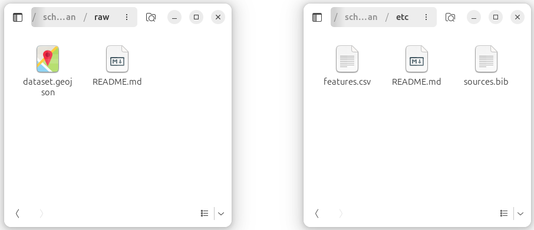

<p align="center">&nbsp;&nbsp;&nbsp;
  <a href="../glottocodes/index.md">Glottocode tutorial &nbsp; ⬅ &nbsp;</a>
  &nbsp;&nbsp;&nbsp;|&nbsp;&nbsp;&nbsp;
  <a href="../README.md">Overview</a>
  &nbsp;&nbsp;&nbsp;|&nbsp;&nbsp;&nbsp;
</p>

# Data curation

This tutorial shows how to turn the language polygons from the [Digitising tutorial](../digitising/index.md), along with their attributes and metadata from the [Attributes and Metadata tutorial](../metadata/index.md), into a dataset ready for [Glottography](https://github.com/Glottography). Data curation aggregates the polygons into languages and language families according to Glottolog.


## Requirements

**Software:** 

[Python 3](https://www.python.org/) is a high-level, free, and open-source programming language. This tutorial uses version 3.12 with the `geopandas`, `pyglottography` and `pybtex` packages installed (see below).

`pyglottography` also requires a working [GDAL](https://gdal.org/en/stable/) installation. GDAL is a library for handling geospatial data formats.

**Data:**  

A GeoPackage file containing the language polygons (see the [Digitising tutorial](../digitising/index.md)) and attributes (see the [Attributes and Metadata tutorial](../attributes/index.md)). The Alor–Pantar language polygons, including attribute data, can be downloaded [here](../digitising/out/schapper2020papuan.gpkg).

A CSV file containing the attribute data, linked to the digitised polygons via the `id` column. The CSV file for the Alor–Pantar language polygons can be downloaded [here](../metadata/out/schapper2020papuan.csv).

A BibTeX file containing a reference to the source publication in BibTeX format.  The BibTeX file for the Alor–Pantar language map can be downloaded [here](../metadata/out/schapper2020papuan.bib).

A local clone of the latest [Glottolog](https://github.com/glottolog) repository (see below). This data will be used to assign the language polygons to languoids classified as languages or families according to Glottolog.


## Overview 

Before we can run the `pyglottography` scripts and curate the language polygons, a bit of housekeeping and data prep is needed. This tutorial covers the following steps:

- [Install the required packages and libraries](#installing-the-required-packages).  
- [Gather all data in the proper format](#gathering-data-in-proper-format), including cloning a local copy of the Glottolog raw data.   
- [Initiate the Glottography dataset](#initiating-a-glottography-dataset).  
- [Distribute the data into their designated folders](#distributing-the-data-into-their-designated-folders), including the language polygons, attributes and reference.
- [Run the data curation script](#running-the-data-curation-script).


## Installing the required packages

Creating a Glottography dataset requires the [`pyglottography`](https://pypi.org/project/pyglottography/) package, which can be installed from command line or terminal:

```bash
pip install pyglottography
```

The `pyglottography` package builds on the `cldfbench` package, a Python toolkit for creating, managing, and publishing datasets in [CLDF format](https://cldf.clld.org/). CLDF (Cross-Linguistic Data Format) is a standardised format for linguistic data, designed to make cross-linguistic datasets interoperable and easy to process.

We also need the `geopandas` and `pybtex` packages for handling spatial and BibTeX data in this tutorial. If you followed the [Glottocodes tutorial](../glottocodes/index.md) and used the `guess_glottocode` package, `geopandas` should already be installed. If not, you can easily install them from the command line or terminal.


```bash
pip install pyglottography
pip install pybtex
```

Finally, the GDAL library for handling different geospatial data formats is also required. Installation depends on the operating system. Detailled instructions can be found here: [GDAL Download and Installation](https://gdal.org/en/stable/download.html).


## Gathering data in proper format
###  Converting the language polygons to GeoJSON format

When digitising the language polygons, we stored them in GeoPackage format, a well-supported format in QGIS for handling spatial data. `pyglottography`, however, requires GeoJSON, a lightweight, human-readable format for representing geographic features, so we need to convert the GeoPackage. This task that takes little more than a line of Python code:

```python
import geopandas as gpd
polygons = gpd.read_file("schapper2020papuan.gpkg")
polygons.to_file("dataset.geojson", driver="GeoJSON")
```

You might be wondering why we don't use GeoJSON from the start. GeoPackages allow local projections, which can be useful during digitisation for higher accuracy.  In contrast, GeoJSON coordinates must be in longitude and latitude using decimal degrees, corresponding to the `EPSG:4326` coordinate reference system (CRS). When digitising benefits from a local CRS, GeoPackages are preferable. In short, while GeoPackage is more flexible for digitising in QGIS, GeoJSON is more human-readable and can even be displayed in many web browsers. This is why we use both formats.

Note that the script above assumes the GeoPackage data is already in the `EPSG:4326` CRS, which is true for our dataset. If a different CRS was used during digitisation, the data must be reprojected to `EPSG:4326` first. Note also that the output file name (`dataset.geojson`) already hints at an important aspect of running the `pyglottography` data curation: the script expects all input data to follow specific naming conventions and be placed in designated locations on your computer.

### Cloning the Glottolog data 

The `pyglottography` package uses Glottolog to align the polygons with languages and language families. To do this, it requires a local copy of the Glottolog raw data, which can be cloned from GitHub. Cloning creates a full local copy of the Glottolog repository on a local computer. Navigate to a suitable folder and clone the current release of the Glottolog raw data from GitHub using the command line or terminal:

```bash
git clone https://github.com/glottolog/glottolog.git
```

Whenever you use the Glottolog data to curate a new Glottography dataset, make sure your local copy is up to date, and pull the latest version from GitHub if necessary:

```bash
git status
git pull
```

This checks the status of your local repository and pulls the latest changes from GitHub.


## Initiating a Glottography dataset

Next, we initiate a new Glottography dataset from the command line or terminal:

```bash
cldfbench new --template glottography
```

This command uses the Glottography template provided by `cldfbench` to create a ready-to-use dataset skeleton. It sets up the folder structure, including subfolders for raw data, scripts, and output, and includes the initial configuration files needed for `pyglottography` to recognise and process the dataset. You will be prompted to provide the following information via command line: 


- `id`: the BibTex handle of your project (here: schapper2020papuan)
- `title`: the title of the dataset (here: Glottography dataset derived from Schapper 2020 "Introduction to the Papuan Languages of Timor, Alor, and Pantar")
- `license`: A user license (here: CC-BY-4.0)
- `url`: The URL associated with the project (here: NULL) 
- `citation`: A human readable citation (here: Schapper, Antoinette. 2020. "Introduction to the Papuan Languages of Timor, Alor, and Pantar." In *Volume 3*, edited by Antoinette Schapper, 1–52. Berlin, Boston: De Gruyter Mouton. doi:10.1515/9781501511158-001. https://doi.org/10.1515/9781501511158-001.) 

The screenshot below shows the folder structure of the newly initialised Glottography dataset. 

<figure>
  
  <figcaption><em>The folder structure in a Glottogaphy dataset.</em></figcaption>
</figure>

&nbsp;


The three main folders are still mostly empty:

- `etc`: in this folder, the curation script expects the CSV file containing the attribute data and the BibTeX file containing a reference to the source publication
- `raw`: in this folder, the curation script expects the (raw) language polygons in GeoJSON format 
- `cldf`: in this folder the curation script stores the CLDF datasets, i.e. the polygons aggragated to the Glottolog languages and language families

## Distributing the data into their designated folders

Next, we distribute the language polygons, attribute data, and reference into their designated folders. The `pyglottography` curation script requires the data to follow specific file-naming conventions and to be stored in the correct folders:

* The language polygons (in GeoJSON format) must be named `dataset.geojson`. Each language Multipolygon in this file must have a unique `id`. The file belongs in the `raw` folder.

* The attribute data must be provided in a CSV file named `features.csv`. This file must contain an `id` column with values corresponding to the language Multipolygons in `dataset.geojson`. It belongs in the `etc` folder.

* The reference data must be provided in a BibTeX file named `sources.bib`, containing a single citation for the source publication. The file also belongs in the `etc` folder.

Why is there a separate attribute file? While the metadata could, in principle, be read directly from the attributes in the GeoJSON file, `pyglottography` instead relies on the CSV file. This approach makes data curation and updating easier and more transparent. Since the Glottolog language catalog is updated about twice a year, it must be possible to regenerate a Glottography dataset with updated Glottocodes. By keeping attributes in a separate CSV file, updates involve editing only a plain text file without geometry, something that can easily be done in any text editor and tracked with version-control software such as Git.

The screenshot below shows the `raw` and the `etc` folder after distributing the data. 

<figure>
  
  <figcaption><em>The <code>raw</code> and <code>etc</code> folders after distributing the language polygons (<code>dataset.geojson</code>), attributes (<code>features.csv</code>), and reference (<code>sources.bib</code>).</em></figcaption>
</figure>

&nbsp;


## Running the data curation script

With all data in place, we can now run the curation process. From a command-line terminal, navigate into the Glottography dataset folder and invoke the `makecldf` command, pointing it to the dataset script. The `--glottolog` flag specifies the path to your local clone of the Glottolog data:

```bash
cd schapper2020papuan
cldfbench makecldf cldfbench_schapper2020papuan.py --glottolog PATH_TO_GLOTTOLOG
```
The `makecldf` command is part of the cldfbench workflow. It takes care of assembling the CLDF dataset from the language polygons in the `raw` folder and attributes and reference in the `etc` folder.
   
## Output

The CLDF folder includes three sets of vector geometries enriched with Glottocodes at three levels of aggregation in GeoJSON format:

The `cldf` folder includes three sets of vector geometries, each enriched with Glottocodes and provided at different levels of aggregation in GeoJSON format:

**Features:** Speaker areas retaining the classification from the source publication (`features.geojson`). The Features GeoJSON file of the Alor–Pantar languages map can be downloaded [here](out/features.geojson).

**Language areas:** Speaker areas aggregated at the language level according to Glottolog's classification (`languages.geojson`). The Language areas GeoJSON file of the Alor–Pantar languages map can be downloaded [here](out/languages.geojson).

**Family areas:** Speaker areas aggregated at the language family level according to Glottolog's classification (`families.geojson`). The Family areas GeoJSON file of the Alor–Pantar languages map can be downloaded [here](out/families.geojson).

---------
<p align="center">&nbsp;&nbsp;&nbsp;
  <a href="../glottocodes/index.md">Glottocode tutorial &nbsp; ⬅ &nbsp;</a>
  &nbsp;&nbsp;&nbsp;|&nbsp;&nbsp;&nbsp;
  <a href="../README.md">Overview</a>
  &nbsp;&nbsp;&nbsp;|&nbsp;&nbsp;&nbsp;
</p>


