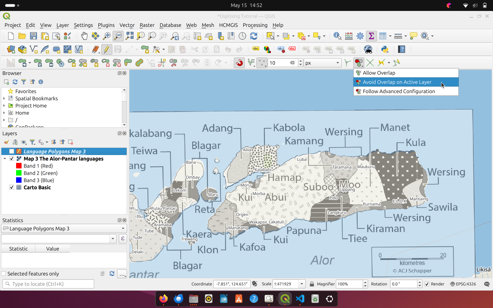
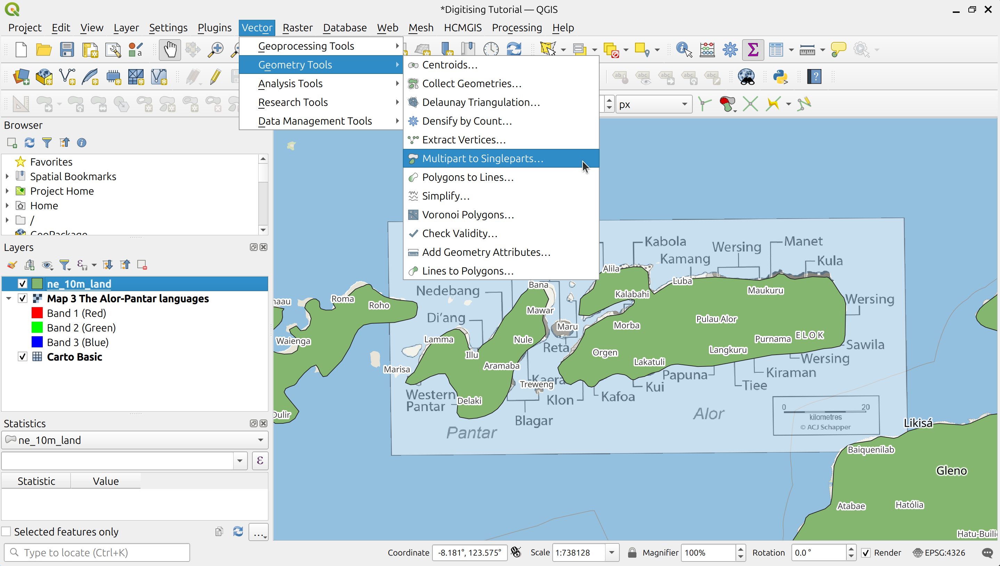
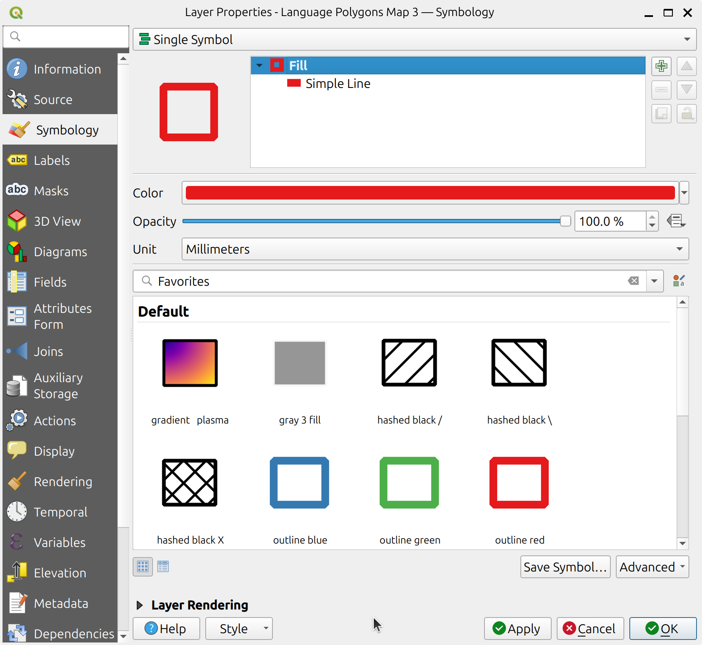

 # Digitising language polygons in QGIS

Digitising is the process of tracing features from a georeferenced map and converting them into digital points, lines, or— in our case—polygons that a GIS can interpret. In this tutorial, we will digitise the language areas shown on the Alor-Pantar map by Schapper (2020), which we georeferenced in the [Georeferencing tutorial](../georeferencing/index.md). We will explore different approaches to digitising language polygons from a language map.

### A: [Digitising Language Polygons fom scratch](#digitising-language-polygons-from-scratch)
This method involves manually drawing polygons one by one. It is quick and straightforward but can introduce geometric and topological inconsistencies, particularly where the language map does not align well with coastlines or landforms. This issue is more likely to occur with maps that have coarse spatial resolution or inaccurate georeferencing. Conversely, digitising from scratch is best suited to inland regions, where coastal accuracy is less important, or to high-resolution maps that have been accurately georeferenced.

### B: [Splitting language polygons from existing landforms](#splitting-language-polygons-from-existing-landforms)
This method involves splitting language areas from an existing polygon dataset of continents and landforms. The resulting language polygons follow coastlines and land boundaries derived from high-resolution satellite imagery, which are often more accurate than those shown on a scanned or georeferenced map. However, a key limitation is that the language polygons are constrained by the boundaries of the existing dataset, which may omit small or irregular geographic features, such as islands or narrow coastal strips.

---

# Digitising language polygons from scratch

Before digitising, we need to load the **georeferenced raster map** of the Alor Pantar languages we created in the [Georeferencing tutorial](../georeferencing/index.md). Go to **Layer** > **Add Layer** > **Add Raster Layer...** and locate the file, or drag and drop the file into the **Layers** panel.

We also open the **Carto Basic** basemap from the **HCMGIS** plugin as a spatial reference:  **HCMGIS** > **Basemaps** > **Vector tiles** > **Carto Basic**.

Next, we create an empty polygon vector layer to store the digitised language areas. To do this, go to **Layer** > **Create Layer** > **New GeoPackage Layer...** to initialise a new **GeoPackage** file.  **GeoPackage (.gpkg)** is a file format for storing geographic features and has become the de facto standard in QGIS. The file will act as a container for the language polygons we are about to digitise.

<figure>
  
  <figcaption><em>Creating a new GeoPackage layer.</em></figcaption>
</figure>

&nbsp;

A dialog appears, prompting you to define the properties of the GeoPackage, including the geometry type (point, line, or polygon), the coordinate reference system (CRS), and the (non-spatial) attributes.

<figure>
  
  <figcaption><em>The GeoPackage dialog.</em></figcaption>
</figure>

&nbsp;

In the dialog box, click the `...` button next to **Database** to choose a location and file name for the output GeoPackage file. Under **Layer name**, enter a name for the polygon layer. This name will appear in the QGIS **Layers** panel. Set the **Geometry type** to `Polygon`. Choose a **Coordinate Reference System (CRS)** for the layer. Here, we use the standard `EPSG:4326 - WGS 84`, though other CRS may be more appropriate depending on the region you want to digitise. Next, define the **attribute fields** to store information about each polygon. In the **New Field** section, add the following fields:

| Field Name      | Type          |
|-----------------|---------------|
| `name`          | Text (string) |
| `map_name_full` | Text (string) |
| `year`          | Text (string) |
| `glottocode`    | Text (string) |
| `note`          | Text (string) |

For a detailed explanation of all attributes needed for Glottography polygons, see the [Metadata tutorial](../metadata/index.md). In the **Advanced** section, change the name of the **Feature id column** to `id`. Once all fields are defined, click **OK** to create the GeoPackage layer.

## Start Digitising

Ensure that your new GeoPackage layer is selected in the **Layers** panel. Enable **Edit Mode** by clicking the **pencil icon** in the toolbar, or right-click the layer and select **Toggle Editing**.

<figure>
  
  <figcaption><em>Toggle Editing.</em></figcaption>
</figure>

&nbsp;

The icons in the **Digitizing Toolbar** should now become active. Click the **Add Polygon Feature** tool.

<figure>
  
  <figcaption><em>Activate the Add Polygon Feature.</em></figcaption>
</figure>

&nbsp;

To create a language polygon, click on the map to trace the language area, placing one vertex at a time. Right-click to finish and close the polygon.

<figure>
  
  <figcaption><em>Digitising a language area.</em></figcaption>
</figure>

&nbsp;

Right-clicking will also open a dialog box where you can enter attribute values for the feature you just created. For example, here we enter information for the *Wersing* language, including its name, Glottocode, map name and year. Notice how the ID is automatically generated (Autogenerate), ensuring no duplicates

<figure>
  
  <figcaption><em>Adding attributes.</em></figcaption>
</figure>

&nbsp;

To save your edits, click the **Save Layer Edits** button (disk icon), or toggle editing off again.

<figure>
  
  <figcaption><em>Save layer edits.</em></figcaption>
</figure>

&nbsp;

Don’t forget to save your QGIS project regularly by going to **Project** > **Save As...** to ensure that all your settings, layers, and views are preserved for future use. Now all you have to do is repeat the process to trace the remaining language areas on the map. The final digitised map should look something like this.

<figure>
  
  <figcaption><em>The digitised language map.</em></figcaption>
</figure>

&nbsp;

## Snapping 

To improve the accuracy of your digitising when adding polygons, you can enable **snapping** so that new features align precisely with existing ones. First, make sure the **Snapping Toolbar** is visible. Go to **View** > **Toolbars** > **Snapping Toolbar**. In the **Snapping Toolbar**, click the **magnet icon** to enable snapping.

<figure>
  
  <figcaption><em>Snapping Toolbar with Snapping enabled.</em></figcaption>
</figure>

&nbsp;

Set the **snapping distance**. Typically 10 pixels is a good starting point. Next, check the option **Avoid Overlap on Active Layer**. This ensures that any new polygons you draw will not overlap with existing polygons in the same layer.

<figure>
  
  <figcaption><em>Activate Avoid Overlap on Active Layer.</em></figcaption>
</figure>

&nbsp;

Digitising now works as before, but with one key difference: QGIS will automatically snap new vertices to nearby existing ones when in snapping distance, helping you maintain clean, topologically correct boundaries.

## Cutting enclave language polygons

In some cases, a language area may be completely surrounded by another.  An example is _Pennsylvania Dutch_ in the USA, entirely enclosed by English-speaking regions.  For such a language enclave, we first cut a hole in the surrounding language area and then fill that hole with a new polygon representing the enclave language. This approach is suited for very specific cases and may not be commonly needed. However, in situations where an isolated language enclave exists, it is often the only viable method. While there is no such enclave on the Alor-Pantar language map, we will briefly walk through the steps required to create one. Click the **Toggle Editing** icon to start editing.  Ensure the **Advanced Digitizing Toolbar** is active.  If not, go to **View** > **Toolbars** > **Advanced Digitizing Toolbar**. In the **Advanced Digitizing Toolbar**, click the **Fill Ring** icon.

<figure>
  
  <figcaption><em>Activate the Fill Ring tool.</em></figcaption>
</figure>

&nbsp;

The **Fill Ring** tool is now active.  This tool cuts a ring into a polygon and fills it with a new polygon. Trace the enclave as you would any other language polygon. Right-click to finish, and enter the attribute information for the enclave language. Note: We're demonstrating this here solely to showcase the method—there are no enclave languages in the Alor-Pantar map.

<figure>
  
  <figcaption><em>Cut out and fill the ring.</em></figcaption>
</figure>

&nbsp;

You can now select the filled ring to verify that the tool created a new polygon.

<figure>
  
  <figcaption><em>We cut a ring into a language polygon and filled it. While this may not make much sense on this map, it helps us create polygons for language enclaves.</em></figcaption>
</figure>

&nbsp;

# Splitting language polygons from existing landforms

This method splits language areas from an existing polygon dataset of continents and landforms. We use the **Land polygons including major islands** from the [1:10m Physical Vectors by Natural Earth](https://www.naturalearthdata.com/downloads/10m-physical-vectors/).  The Natural Earth land polygons are available as shapefiles, a legacy standard for storing geographic vector data. To load the shapefile in QGIS, go to **Layer** > **Add Layer** > **Add Vector Layer...**, browse to the file location of the Natural Earth land polygon shapefile, and click **Add**. Alternatively, you can simply drag and drop the shapefile into the **Layers** panel in QGIS. 

<figure>
  
  <figcaption><em>The Natural Earth Land Polygons.</em></figcaption>
</figure>

&nbsp;

We can already see that the Natural Earth land polygons are not detailed enough for this region — they are missing the Pura and Treweng islands. While we likely wouldn’t use this dataset for digitising this language map, we will carry on for the sake of demonstrating how to cut language polygons.

## Preparing the Base Layer for Digitising

The Natural Earth land polygons will serve as the base from which we cut out the digitised language areas. Before we begin digitising, we need to prepare this vector layer for the task. Shapefiles are a clunky, legacy format that store geometry and attribute data across separate files. To streamline our workflow, we convert the layer to a **GeoPackage**. Right-click the layer in the **Layers** panel and go to **Export** > **Save Features As...**.

<figure>
  
  <figcaption><em>Export the Natural Earth Land Polygons.</em></figcaption>
</figure>

A dialog appears. Set the **Format** to `GeoPackage`, and specify the **File name** and location for the output file. You can leave the other settings as they are.

<figure>
  
  <figcaption><em>Save the Natural Earth Land Polygons as GeoPackage.</em></figcaption>
</figure>

The Natural Earth polygons are stored as large **Multipolygons**, each containing potentially hundreds of individual polygons. Before digitising, we need to separate these into their individual components using the **Multipart to Singleparts** tool. Go to **Processing Toolbox** > **Vector geometry** > **Multipart to Singleparts...**.

<figure>
  
  <figcaption><em>Open the Multipart to Singleparts tool.</em></figcaption>
</figure>

In the dialog, set the **Input layer** to the Natural Earth land polygons and define the file name and location for the single parts. Again, use the **GeoPackage** format.

<figure>
  
  <figcaption><em>The Multipart to Singleparts tool.</em></figcaption>
</figure>

Click **Run**. This will generate a new layer where each polygon becomes a separate feature.

### Cropping to the Language Map Region

Next, we crop the single-part land polygons to the region covered by our language map. Click the **Select Features by Polygon** icon in the toolbar.

<figure>
  
  <figcaption><em>Activate Select Features by Polygon.</em></figcaption>
</figure>

Draw a polygon around the area of interest to select all overlapping land polygons.

<figure>
  
  <figcaption><em>Select the land polygons overlapping the language map.</em></figcaption>
</figure>

Once the features are selected, export them as a new layer.  Right-click the layer and go to **Export** > **Save Selected Features As...**.
This will isolate only the polygons within your region of interest

<figure>
  
  <figcaption><em>Export the selected land polygons.</em></figcaption>
</figure>

In the dialog, save the selected features as a **GeoPackage**. Use the name of the language map as the file name and rename the `fid` column to `id` to match Glottography requirements.

<figure>
  
  <figcaption><em>Save the selected land polygons as GeoPackage.</em></figcaption>
</figure>

We have now cropped the Natural Earth polygons to only those overlapping with the language map.

## Editing the Attribute Table

Next, we prepare the attribute table by removing irrelevant fields and adding those required by Glottography. Right-click the cropped layer and select **Open Attribute Table**.

<figure>
  
  <figcaption><em>Open the Attribute Table of the cropped land polygons.</em></figcaption>
</figure>

Click the **Toggle Editing** icon to enable edits.

<figure>
  
  <figcaption><em>Start editing the attributes.</em></figcaption>
</figure>

Click the **Delete Field** icon to remove irreleavant attributes.

<figure>
  
  <figcaption><em>Delete fields.</em></figcaption>
</figure>

In the dialog, mark all fields for deletion except for `id`, and click OK.

<figure>
  
  <figcaption><em>The delete fields dialog.</em></figcaption>
</figure>

With irrelevant fields removed, begin adding the required attributes by clicking the **New Field** icon.

<figure>
  
  <figcaption><em>Adding new attribute fields.</em></figcaption>
</figure>

Add a new field called `glottocode` as a Text (string) with 8 characters.

<figure>
  
  <figcaption><em>Adding a new field for glottocodes.</em></figcaption>
</figure>

Repeat the process to add the remaining fields: `name`, `full_map_name`, `year`, and `note`.  Once done, save your edits.

<figure>
  
  <figcaption><em>Saving the added attributes.</em></figcaption>
</figure>

Your layer is now ready for splitting off language areas.

## Splitting Language Polygons

To better see the map beneath, adjust the visual appearance of the cropped layer.  Right-click the layer and select **Properties**.

<figure>
  
  <figcaption><em>Opening the properties.</em></figcaption>
</figure>

Navigate to the **Symbology** tab and change the style to a polygon with a visible outline and no fill.

<figure>
  
  <figcaption><em>Change the layer symbology.</em></figcaption>
</figure>

Now we begin digitising. Click the **Toggle Editing** icon to start editing.

<figure>
  
  <figcaption><em>Start editing.</em></figcaption>
</figure>

Ensure the **Advanced Digitizing Toolbar** is active. If not go to **View** > **Toolbars** > **Advanced Digitizing Toolbar**. Click the **Split Features** tool and begin tracing the boundary of the language polygon.

<figure>
  
  <figcaption><em>Activate the split features tool.</em></figcaption>
</figure>

To trace the Kiraman language area, start in the ocean southwest of the landmass, cut across the polygon boundary, trace the language area northeastwards, then east and south, cutting back across the polygon boundary. Finish the shape with a right-click.  Tip: Disable [snapping](#snapping) by clicking the magnet icon. Snapping is helpful in other digitising tasks but can hinder working with the **Split Features** tool.

<figure>
  
  <figcaption><em>Splitting the Kiraman language area off the Natural Earth polygon of Alor island.</em></figcaption>
</figure>

If you receive the error message:  **"No features were split: If there are selected features, the split tool only applies to those..."**,   this usually means the wrong feature was selected.  Click **Deselect Features from All Layers** to fix the issue.

## Adding Attribute Information

After tracing a language polygon, fill in the attribute fields.  Use the **Identify Features** tool and ensure only the new polygon is highlighted.

<figure>
  
  <figcaption><em>Activate the Identify Feature tool.</em></figcaption>
</figure>

In the **Identify Results** panel, click **Edit Feature Form**.

<figure>
  
  <figcaption><em>Activate the Edit Feature dialog.</em></figcaption>
</figure>

A dialog will open where you can enter the relevant attribute data for the Kiraman language area.

<figure>
  
  <figcaption><em>Fill in the feature attributes for the Kiraman language area.</em></figcaption>
</figure>

Click **Save** when done. Repeat the process until all language polygons are split from the Natural Earth land polygons.
