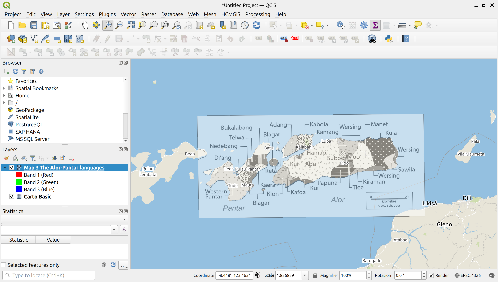

# Georeferencing language maps in QGIS

This tutorial walks you through the process of georeferencing a language map provided as a raster image in QGIS. Georeferencing assigns geographic coordinates to the map, enabling it to be accurately located and displayed in a geographic information system (GIS).
QGIS is a free, open-source GIS platform available for download [here](https://qgis.org).

We will georeference a map of the Alor-Pantar languages in Indonesia from the article *"Introduction to The Papuan Languages of Timor, Alor and Pantar"* by Schapper (2020). The map is available as a raster image in jpg-format.

<figure>
  
  <figcaption><em>Map of the Alor Pantar languages from Schapper (2020)</em></figcaption>
</figure>

## Adding a basemap
Before we can georeference the Alor-Pantar map, we first open a basemap in QGIS. The basemap serves as a reference for accurately aligning the language map. To do this, go to `HCMGIS > Basemaps > Vector tiles > Carto Basic` to add the **Carto Basic** basemap from the **HCMGIS** plugin. **Carto Basic** is a clean, visually neutral basemap that uses data from **OpenStreetMap**.

<figure>
  
   <figcaption><em>Adding the Carto Basic map as basemap.</em></figcaption>
</figure>

&nbsp;

The **HCMGIS** plugin provides quick access to a wide range of ready-to-use basemaps, including OpenStreetMap, Google Maps, and satellite imagery. If the plugin is not already installed, you’ll need to [install it](https://mapscaping.com/hcmgis-plugin-in-qgis/).

## The Georeferencer plugin

Now we can use the **Georeferencer** plugin to align the Alor-Pantar map with the basemap. To open the plugin, go to `Layer > Georeferencer...`. The **Georeferencer** window will appear.

<figure>
  
  <figcaption><em>Open the Georeferencer plugin.</em></figcaption>
</figure>

&nbsp;

The **Georeferencer** window is divided into two main tiles. The map tile in the top shows the raster image that will be georeferenced. In this tile you'll add the ground control points (GCPs) to align the language map with the basemap. The bottom tile shows the GCP Table with all ground control points you’ve added, including their pixel locations, geographic coordinates, and an estimate of their accuracy. To add the language map to the top tile, click the `Open Raster...` icon and navigate to the location of the raster image file on your computer.

<figure>
  
  <figcaption><em>Open the language map in the Georeferencer.</em></figcaption>
</figure>

&nbsp;

## Setting the ground control points

The top tile now shows the Alor Pantar map. To begin georeferencing, click the `Add Point` icon. 

<figure>
  
  <figcaption><em>Add a ground control point.</em></figcaption>
</figure>

&nbsp;

Now locate a distinct geographic feature on the language map that is also visible on the basemap. This feature will act as a ground control point (GCP) to help align the two maps. For example, you could use the tip of a coastline, as we do here. Other suitable control points might include river bends, confluences, mountain peaks, road intersections, or any other recognisable geographic feature visible on both maps. Click on the selected feature on the language map, and the **Enter Map Coordinates** window will appear.

<figure>
  
  <figcaption><em>The Enter Map Coordinates window.</em></figcaption>
</figure>

&nbsp;

The window prompts you to enter the geographic coordinates of the GCP in the `X / East` and `Y / North` fields. If you happen to know the coordinates of the feature — kudos, you are a mighty geographer. Usually, though, you won't. Instead, click the `From Map Canvas` icon at the bottom of the window. You will be returned to the basemap. Locate the same feature on the basemap — in our case, the tip of the coastline — and click on it. The point you just clicked will appear as a green dot on the basemap.

<figure>
  
  <figcaption><em>The green dot marks the ground control point on the basemap.</em></figcaption>
</figure>

&nbsp;

Return to the **Enter Map Coordinates** window. The coordinates of the GCP will now appear in the `X / East` and `Y / North` fields, using the coordinate reference system (CRS) of the basemap, which in our case is `EPSG:3857 (WGS 84 / Pseudo-Mercator)`.

<figure>
  
  <figcaption><em>The Enter Map Coordinates window shows the numeric coordinates of the first GCP.</em></figcaption>
</figure>

&nbsp;

Click `OK` to add the GCP. You will be returned to the **Georeferencer** window, where the GCP appears as a red dot on the language map. Its map and image coordinates are also listed in the GCP Table.

<figure>
  
  <figcaption><em>The ground control point on the language map.</em></figcaption>
</figure>

&nbsp;

Rinse and repeat to add more GCPs equally distributed around the map image. For this relatively simple map, around seven control points  along the coastline of the Alor and Pantar islands should be sufficient. You can always add more points later if the georeferenced map shows distortions or doesn't align properly.

<figure>
  
  <figcaption><em>Seven GCPs on the language map.</em></figcaption>
</figure>

&nbsp;

## Perform the georeferencing 

Once you have placed a sufficient number of ground control points to accurately anchor your language map to the real-world coordinates of the basemap, you can proceed to run the georeferencing. Click on the **`Transformation Settings`** icon in the toolbar.

<figure>
  
  <figcaption><em>Open the Transformation settings window.</em></figcaption>
</figure>

&nbsp;

A dialog window opens where you can configure the georeferincing process to properly align your map with the basemap.

<figure>
  
  <figcaption><em>The Transformation Settings window.</em></figcaption>
</figure>

&nbsp;

In the **`Transformation Parameters`** section, define the technical settings for the transformation:

- **`Transformation type`**: Choose the mathematical model used to convert your image’s pixel coordinates into geographic coordinates:
  - **Linear**: Suitable for transformations with minimal distortion.
  - **Helmert**: Allows for scaling, rotation, and translation but preserves shape and angle — suitable when the map needs to be aligned through simple geometric shifts.
  - **Polynomial (1st, 2nd, 3rd order)**: More flexible transformation for correcting distortions in scanned maps.
  - **Thin Plate Spline (TPS)**: Ideal for complex, non-linear transformation from historical maps.
  - **Projective**: Maintains straight lines; used for perspective correction.

In the Alor-Pantar map, the projection of the source map is unknown, but only minor distortions are expected due to its location near the equator. For this reason, we use a second-degree polynomial transformation (Polynomial 2).In any case, treat recommendations for a specific transformation type as general guidelines rather than strict rules. No single transformation type is guaranteed to work perfectly in all situations. It’s often best to try out different methods and compare the results to determine which one provides the most accurate alignment.

- **`Target CRS`**: The coordinate reference system (CRS) that the georeferenced map image will be transformed into.  
  If you're unsure which CRS to use, it's generally safest to set it to `EPSG:4326 (WGS 84)`, a widely used global standard. Alternatively, you can match the CRS of the basemap. In our case, that would be `EPSG:3857 (WGS 84 / Pseudo-Mercator)`.  
  Here, we set the output CRS to `EPSG:4326 (WGS 84)`. This differs from the basemap's CRS, but that's fine—QGIS can reproject layers on the fly to ensure proper display alignment.  
  Click **`OK`** to save the transformation settings.

In the **`Output Settings`** section, specify the output details:

- **`Output file`**: Define the name and path where the transformed (georeferenced) image will be saved. The (Geo)TIFF format preserves spatial referencing.

- **`Resampling Method`**: Choose how pixel values will be interpolated during the transformation.  
  Since we will use the georeferenced map only for digitising polygons, we can use **Nearest Neighbor** resampling. This is the simplest and fastest method and it preserves the original pixel values.

## Start the Georeferencing

Finally, click the **`Start Georeferencing`** icon to begin aligning the language map with the basemap.

<figure>
  
  <figcaption><em>Start the georeferencing.</em></figcaption>
</figure>

&nbsp;

The georeferenced map is added as a new layer. By setting the layer to transparent, you can verify that it aligns well with the basemap.

<figure>
  
  <figcaption><em>The georeferenced map.</em></figcaption>
</figure>

&nbsp;

We can now proceed to digitise the language polygons from the georeferenced map. This process will be covered in the next tutorial.

## References

Schapper, Antoinette. 2020. *Introduction to The Papuan Languages of Timor, Alor and Pantar*. In Antoinette Schapper (ed.), *The Papuan Languages of Timor, Alor and Pantar: Volume 3*, pp. 1–52. Berlin, Boston: De Gruyter Mouton. [https://doi.org/10.1515/9781501511158-001](https://doi.org/10.1515/9781501511158-001)
