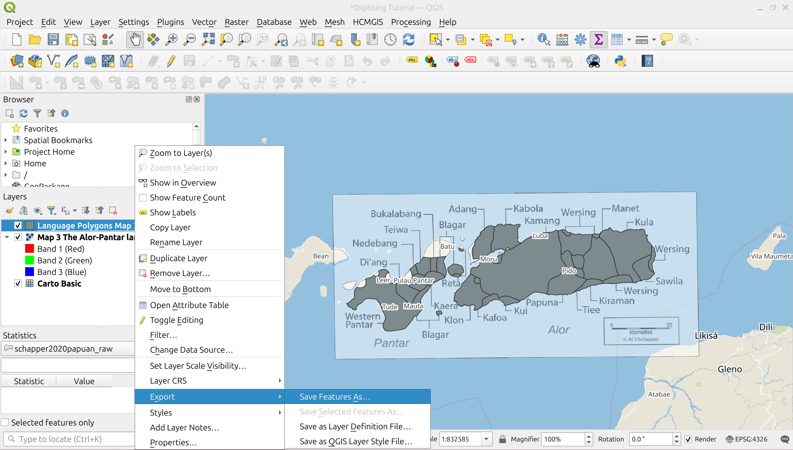
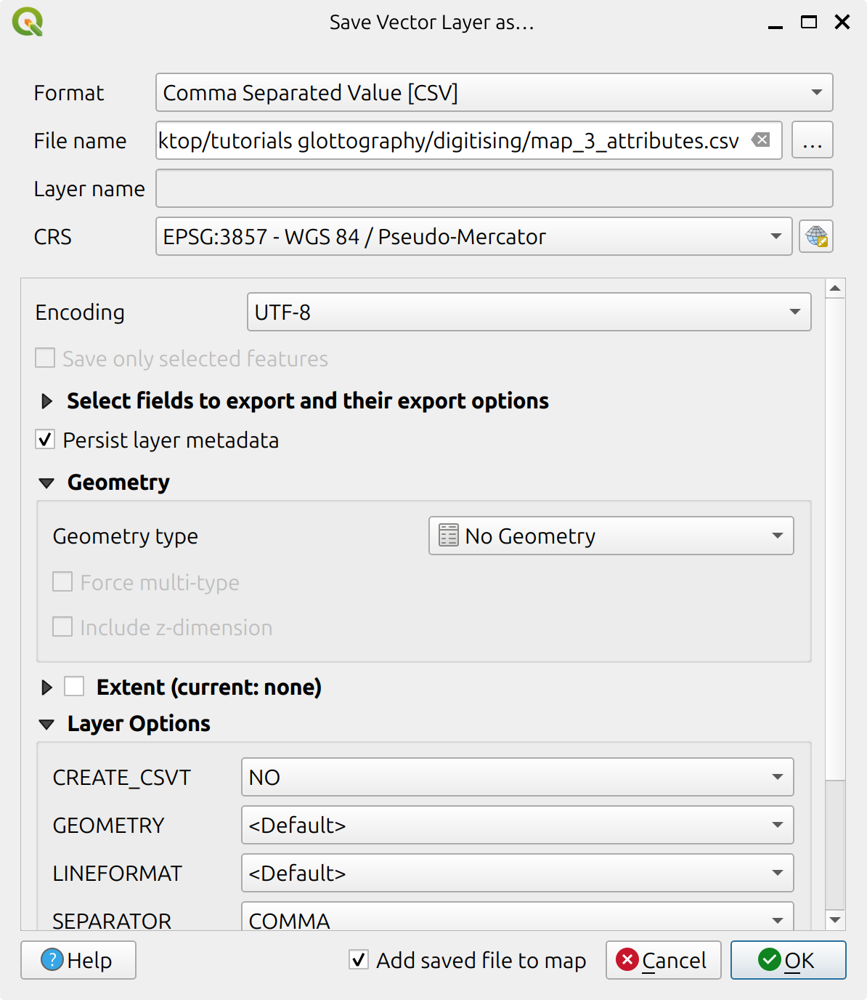

# Attributes and Metadata

This tutorial introduces the attributes and metadate required when digitising Glottography language areas from source publications. Glottography uses BibTeX entries to uniquely reference each source publication, and Glottocodes to identify the languages depicted in their maps. Because Glottocodes were introduced only relatively recently, many source publications — especially older ones — likely do not include them. As a result, assigning the correct Glottocodes to a language area can be time-consuming and may require additional effort. To assist with this process, a separate [Glottocode tutorial](../glottocodes/index.md)  explains how to automatically query and assign Glottocodes to a language area based on language name and geographic location.

## Requirements 
**Software**: [QGIS](https://qgis.org) is a free and open-source geographic information system (GIS). This tutorial uses version QGIS 3.34.4-Prizren.

**Data:** Digitised language polygons in GeoPackage format (`.gpkg`).  In this tutorial, we use the digitised Alor–Pantar language polygons from the [Digitising tutorial](../digitising/index.md), which can be downloaded [here](../digitising/out/schapper2020papuan.gpkg).


### Metadata
#### Referencing the source publication

A source publication is any piece of work that includes a language map we wish to incorporate into Glottography. For example, the map of the Alor and Pantar languages that we [georeferenced](../georeferencing/index.md) and [digitised](../digitising/index.md) earlier was taken from the book chapter *Introduction to The Papuan Languages of Timor, Alor and Pantar* (https://doi.org/10.1515/9781501511158-001) by Schapper (2020). Glottography records source publications using the BibTeX format. BibTeX stores metadata on bibliography items, such as articles, books, and theses, in plain text files, typically with the `.bib` file extension. A single BibTeX file can contain multiple entries, but for our purposes, each file must contain exactly one. The publication by Schapper (2020) has the following BibTeX entry:


```bibtex
@inbook{schapper2020papuan,
    url = {https://doi.org/10.1515/9781501511158-001},
    title = {1. Introduction to The Papuan languages of Timor, Alor and Pantar. Volume 3},
    booktitle = {Volume 3},
    author = {Antoinette Schapper},
    editor = {Antoinette Schapper},
    publisher = {De Gruyter Mouton},
    address = {Berlin, Boston},
    pages = {1--52},
    doi = {doi:10.1515/9781501511158-001},
    isbn = {9781501511158},
    year = {2020},
    lastchecked = {2023-03-24}
}
```

The BibTeX entry consists of the entry type (e.g., `@inbook`), a citation key (e.g., `schapper2020papuan`), and several fields or tags that define the details of the publication, such as `author`, `title`, and `url`. The type `@inbook` indicates that the source is a chapter in a book. Similarly, `@article` is used for journal articles, and `@book` for standalone books. Glottography requires the citation key to follow the format `authorYYYYtopic`, and the corresponding BibTeX file must be named `authorYYYYtopic.bib`, for example, `schapper2020papuan.bib`. The Glottography import script in the [data curation tutorial](../curation/index.md) depends on both the citation key and the file name being in this exact format to function correctly.


#### How to obtain a BibTeX Entry
There are four main ways to obtain a BibTeX entry for a source publication, which we will briefly cover here.

The easiest method is likely to check Glottolog. By visiting the [Glottolog website](https://glottolog.org/), you can use the "Reference Search" feature to enter bibliographic information such as the author’s name and publication year. Once you retrieve the relevant entry, you can open it, copy the BibTeX citation, and paste it into a plain text editor like Notepad++. You'll then need to adjust the title and citation key to follow the required `authorYYYYtopic` format and save the file under the same name with a `.bib` extension.

Another option is to visit the publisher’s website to see whether an official BibTeX citation is provided. In the example of Schapper (2020), the publisher De Gruyter offers a downloadable BibTeX file. After downloading, you should rename the file and citation key to match the required format.

A third method is to use [Google Scholar](https://scholar.google.com/). You can search for the publication there, click “Cite” and then choose the BibTeX export option. As with the other methods, you will need to change the citation key and rename the file. However, BibTeX entries from Google Scholar are often incomplete. They may lack key metadata like DOIs or URLs and sometimes misclassify the type of publication, for instance confusing articles with book chapters or reports.

Finally, if you are familiar with BibTeX syntax, you can simply write the entry by hand. Regardless of which method you choose, the end result should be a `.bib` file containing a single entry. The file name must follow the `authorYYYYtopic.bib` format, and the citation key inside the file must match the file name.


### Attributes
#### Collecting attribute data for the language areas

When [digitising language areas](../digitising/index.md), **Glottography** requires attribute data describing the languages each area represents. This attribute data is usually recorded during digitisation but can also be added later. The following attributes must be included:

- **`id`** — A unique identifier for each (multi)polygon, for example, `5`. 
- **`name`** — The language name as it appears on the map, for example, `Hamap`.
- **`map_name_full`** — The map name(s) used to uniquely identify the language map(s) in the source publication, for example, `Map3`. If a language area spans multiple maps, the map names should be listed in the `map_name_full` field separated by a vertical bar (`|`), for example, `Map3 | Map4`.
- **`year`** — The year the language area refers to. This can be the date indicated on the source map, or if not explicitly given, the publication year of the source (`2020`). Alternatively, this field may contain approximate dates such as `contemporary` or `before the time of European contact`.
- **`glottocode`** — The [Glottolog](https://glottolog.org/) code assigned to the language, for example, `hama1240`.
- **`note`** — Any additional comments or annotations about the language area or its Glottocode assignment, for example, if the language is extinct or considered a dialect by Glottolog. In this example, no notes are provided.


The table below shows the attributes for selected language areas from the Alor-Pantar map by Schapper (2020).

*Attributes for selected language areas from the Alor-Pantar map*

| id  | name        | map_name_full | year | glottocode | note |
|-----|-------------|---------------|------|------------|------|
| 1   | Abui        | Map3          | 2020 | abui1241   |      |
| 2   | Kiraman     | Map3          | 2020 | kira1248   |      |
| 3   | Blagar      | Map3          | 2020 | blag1240   |      |
| 4   | Bukalabang  | Map3          | 2020 | blag1240   |      |
| 5   | Di'ang      | Map3          | 2020 |            |      |
| 6   | Hamap       | Map3          | 2020 | hama1240   |      |
| 7   | Kabola      | Map3          | 2020 | kabo1247   |      |
| 8   | Kaera       | Map3          | 2020 | kaer1234   |      |
| 9   | Kafoa       | Map3          | 2020 | kafo1240   |      |
| 10  | Kamang      | Map3          | 2020 | kama1365   |      |


#### Exporting the attribute data as CSV

Glottography expects attribute data to be exported to a separate CSV file, where each row corresponds to a digitised language area and is linked to the polygon geometry via a unique identifier (`id`). Keeping metadata in plain-text CSV format makes it easy to update and manage. It is both human-readable and compatible with version control tools like Git. The GeoPackage file can easily be exported as a CSV in QGIS. The following steps assume that QGIS is open and that all language areas and their polygons have been recorded and saved in a GeoPackage, following the [Digitising Tutorial](../digitising/index.md).


In the **Layers** panel, right-click the language polygon layer and select **Export** > **Save Features As...**.

<figure>
  
  <figcaption><em>Export the attribute data.</em></figcaption>
</figure>

&nbsp;

---

In the dialog that appears configure the export settings. Set **Format** to `Comma Separated Value [CSV]` and specify the output file in the **Filename** field. Under **Geometry**, select `No geometry` to exclude geometry data. In **Select fields to export and their export options**, ensure that all relevant fields—including the `id` field—are checked, while irrelevant fields are left unchecked (e.g., the `fid` column that may have been added by QGIS).
 Click **OK** to complete the export.

<figure>
  
  <figcaption><em>Saving the attribute data as CSV.</em></figcaption>
</figure>

&nbsp;

### Output
A BibTeX file containing a reference to the source publication in BibTeX format.  The BibTeX file for the Alor–Pantar language map can be downloaded [here](out/schapper2020papuan.bib).

A GeoPackage file containing the language polygons (see the [Digitising tutorial](../digitising/index.md)) and attributes (see also the [Glottocodes tutorial](../glottocodes/index.md)).  The Alor–Pantar language polygons including atttribute data can be downloaded [here](../digitising/out/schapper2020papuan.gpkg).

A CSV file containing the attribute data, linked to the digitised polygons via the `id` column.  The CSV file for the Alor–Pantar language polygons can be downloaded [here](out/schapper2020papuan.csv).
